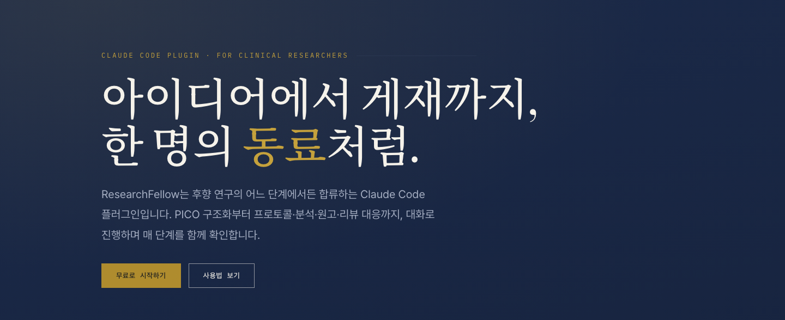
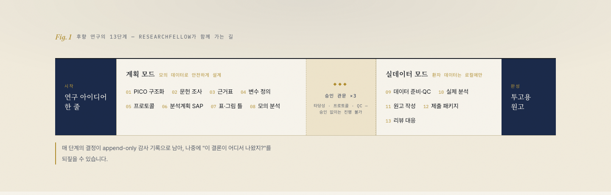
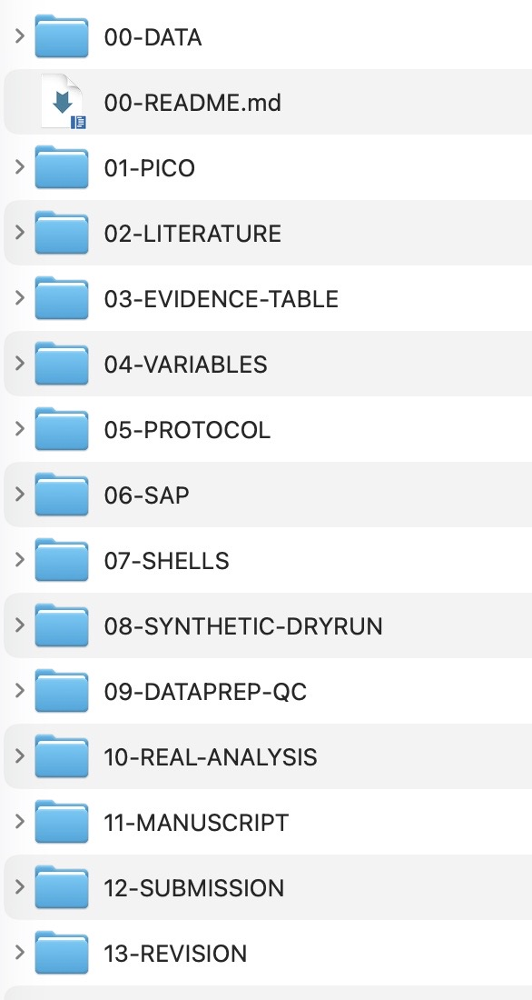
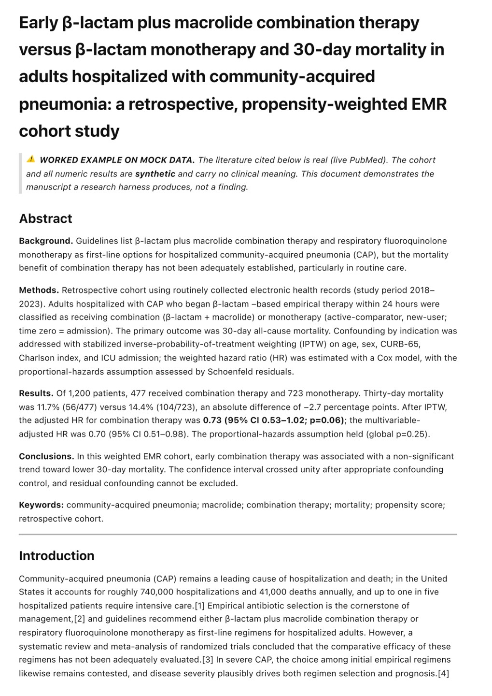

<p align="center">
  <a href="https://researchfellow.vercel.app">
    
  </a>
</p>

<p align="center">
  <a href="https://researchfellow.vercel.app"><b>웹사이트</b></a>
  &nbsp;·&nbsp;
  <a href="https://researchfellow.vercel.app/usage.html">사용법</a>
  &nbsp;·&nbsp;
  <a href="llms.txt">AI 온보딩</a>
  &nbsp;·&nbsp;
  <a href="#설치-복사해서-붙여넣기-2줄">설치</a>
</p>

# ResearchFellow

**연구 아이디어 한 줄만 있어도, 논문 한 편이 완성될 때까지 함께 가는 AI 공동연구자입니다.**

의학 후향 연구(retrospective study)를 아이디어 → 문헌 → 프로토콜 → 통계분석 → 원고 → 리뷰어 대응까지
13단계로 안내합니다. 통계나 논문 작성 경험이 없어도 됩니다 — 매 단계에서 무엇을 할지 제안하고,
중요한 결정은 반드시 여러분에게 확인받고 진행합니다.

> 🔒 **환자 데이터는 절대 여러분의 컴퓨터 밖으로 나가지 않습니다.**
> 모든 데이터 처리는 로컬에서만 이루어집니다.

---

## 이게 뭔가요?

여러분이 채팅하듯 말하면, ResearchFellow가 연구를 함께 진행합니다:

- 💬 *"당뇨 환자에서 메트포르민이 예후에 미치는 영향이 궁금해요"* → PICO로 구조화하고 연구 설계 시작
- 📄 *"쓰다 만 원고가 있어요"* → 원고를 읽고 빠진 부분을 진단해서 이어서 진행
- 📊 *"데이터는 있는데 뭘 연구할지 모르겠어요"* → 데이터에서 연구 후보를 발굴
- ✉️ *"리뷰어 코멘트가 왔어요"* → 대응 편지와 수정 계획을 함께 작성

## 준비물 (1개)

**[Claude Code](https://claude.com/claude-code)** — Anthropic의 AI 코딩/작업 도우미입니다.
터미널(맥의 '터미널' 앱, 윈도우의 PowerShell)에서 아래 한 줄로 설치합니다:

```bash
npm install -g @anthropic-ai/claude-code
```

> 터미널이 처음이라면: 맥에서 `Cmd+Space` → "터미널" 검색 → 위 명령어를 복사해 붙여넣고 Enter.

## 설치 (복사해서 붙여넣기 2줄)

터미널에서 Claude Code를 실행(`claude` 입력)한 뒤, 채팅창에 차례로 입력하세요:

```
/plugin marketplace add Pandoll-AI/researchfellow-plugin
/plugin install researchfellow
```

> 저장소를 내려받아 쓰는 경우엔 URL 대신 폴더 경로를 넣으면 됩니다:
> `/plugin marketplace add /path/to/researchfellow-plugin`
> 두 번째 줄이 안 되면 전체 이름을 쓰세요: `/plugin install researchfellow@researchfellow`

## 시작하기

연구 자료를 모아둘 폴더(없으면 새 폴더)에서 `claude`를 실행하고, 이렇게 입력하세요:

```
/research
```

> ⚠️ `/research`가 인식되지 않으면 전체 이름을 쓰세요: **`/researchfellow:research`**

그러면 이런 질문이 나타납니다 — **번호만 고르면 시작됩니다:**

```
무엇을 하시겠어요?
① 연구 아이디어를 이야기하고 싶어요
② 데이터로 뭘 할 수 있는지 제안받고 싶어요
③ 논문을 새로 쓰기 시작할래요
④ 쓰던 논문을 수정하고 싶어요
⑤ 리뷰어 대응부터 할래요
```

아이디어가 있다면 카드를 고르는 대신 그냥 바로 말해도 됩니다:

```
/research 패혈증 환자에서 스타틴 사용과 사망률의 관련성을 보고 싶어요
```

이후는 대화입니다. 진행 상황은 폴더 안 `.research/`에 자동 저장되므로,
언제든 껐다가 다시 `/research`만 치면 **"이어서: ○○○"** 하고 이어집니다.

> 처음 실행할 때 한 번, **익명 사용 통계 수집 동의**를 요청합니다 — 보내는 것은
> "몇 단계까지 진행했는지" 단계 번호뿐이고, 연구 내용은 절대 전송되지 않습니다.
> 무엇을 보내고 안 보내는지는 [개인정보·텔레메트리 안내](https://researchfellow.vercel.app/privacy.html)에
> 필드 단위로 공개되어 있습니다.

> 💡 환경이 허용되면 인터뷰와 진행 현황이 **브라우저 화면(Desk)** 으로 열립니다 —
> 폼에서 클릭·입력으로 빠르게 진행하고, 여의치 않으면 채팅만으로도 동일하게 진행됩니다.

## 13단계 여정



두 개의 모드로 나뉩니다: **계획 모드(1–8단계)** 는 모의 데이터로 안전하게 설계·연습하고,
**실데이터 모드(9–13단계)** 는 여러분이 직접 승인한 3개 관문(타당성·프로토콜·QC)을
통과해야만 열립니다. 순서대로 갈 필요 없습니다 — 이미 가진 것(프로토콜, 데이터, 초고…)을
주면 해당 단계부터 시작합니다.

## 데이터가 아직 없어도 됩니다 (모의 완주)

실제 데이터가 준비되기 전이라면, 동의를 받고 **가짜 데이터를 생성해 9~13단계까지 전
과정을 미리 체험**할 수 있습니다. 연습 산출물은 `.research/rehearsal/`에 따로 보관되고
모든 파일에 "NOT REAL DATA" 워터마크가 박히며 — 실수로라도 논문 결과로 쓸 수 없도록
시스템이 실제 분석 입력에서 이를 거부합니다.

## 결과물은 이렇게 쌓입니다

연구를 진행하면 각 단계의 산출물이 **폴더별로 차곡차곡** 남습니다. 아이디어(PICO)에서
출발해 **실제 PubMed 문헌**, 근거표·변수 정의, 프로토콜·통계분석계획, 데이터 QC와
분석, 그리고 **원고·제출 패키지**까지 — 전 과정이 로컬에 *감사 가능한* 형태로 축적됩니다.
나중에 "이 결론이 어디서 나왔지?"를 폴더만 열어보면 되돌아볼 수 있습니다.

<table>
<tr>
<td width="38%" valign="top" align="center">

<br><b>① 산출물이 쌓이는 .research/ 폴더</b><br><sub>PICO·프로토콜·SAP·QC·분석·원고까지, 각 단계의<br>산출물과 결정 기록(audit)이 한 폴더에 축적</sub>
</td>
<td width="62%" valign="top" align="center">

<br><b>② 완성되는 원고</b><br><sub>실제 PubMed 인용 + 분석 결과로 채워지고<br>보고지침(STROBE·RECORD)에 맞춘 투고용 초안</sub>
</td>
</tr>
</table>

> 위 예시는 "지역사회획득 폐렴에서 병용 vs 단독 항생제와 30일 사망" 연구를 리허설한
> 것입니다. **문헌은 실제 PubMed 검색 결과**이고, 코호트·수치는 하네스 검증용 **합성(모의)
> 데이터**입니다 — 실제 연구에서는 이 자리에 여러분의 데이터가 들어갑니다.

## 안심하고 쓰셔도 되는 이유

| | |
|---|---|
| 🔒 **개인정보 보호** | 환자 데이터는 로컬에서만 처리. 주민번호·연락처가 섞여 있으면 자동으로 경고 |
| 📊 **익명 사용 통계만** | 첫 실행 시 동의를 받아 "몇 단계까지 진행했는지" 단계 번호만 익명으로 기록 — 연구 내용(아이디어·데이터·원고·대화)은 절대 전송되지 않습니다. 언제든 철회 가능 · [상세 안내](https://researchfellow.vercel.app/privacy.html) |
| 🧪 **가짜 데이터로 먼저 연습** | 데이터가 없어도 동의하에 합성 데이터로 전 과정을 모의 완주 — 연습 산출물엔 워터마크가 박혀 실제 분석에 절대 섞이지 않습니다 |
| 🚦 **함부로 진행하지 않음** | 실제 데이터 분석은 3개 관문(타당성·프로토콜·QC)을 여러분이 직접 승인해야만 실행 |
| 📜 **모든 결정이 기록됨** | 언제 무엇을 승인했는지 `audit.jsonl`에 전부 남아 감사 가능 |
| 🚫 **연구 부정 방지 내장** | 합성 결과의 원고 삽입 금지, 근거 없는 수치 주장 금지 등이 시스템 차원에서 차단 |

## 자주 묻는 질문

**Q. 아직 데이터가 없는데 써볼 수 있나요?**
네. "모의 완주"를 제안받아 가짜 데이터로 13단계 전 과정을 미리 체험할 수 있습니다.
연습 산출물은 별도 폴더에 워터마크와 함께 보관되어 실제 연구와 절대 섞이지 않습니다.

**Q. IRB 승인이 있어야 시작할 수 있나요?**
시작에는 필요 없습니다 — 설계·프로토콜·모의 분석(1~8단계)은 데이터 없이 진행됩니다.
IRB·데이터 접근 권한은 연구자 본인의 자기 점검 목록으로 관리되며, 투고 단계에서
확인만 안내합니다.

**Q. 통계 프로그램(R, SPSS)이 필요한가요?**
아니요. 기본 분석은 내장 도구로 실행됩니다. (파이썬 pandas/statsmodels가 설치돼 있으면 더 많은 분석이 가능해집니다.)

**Q. 인터넷이 필요한가요?**
문헌 검색(PubMed)에만 필요합니다. 그 외 전 과정은 오프라인으로 완주 가능합니다.

**Q. 비용이 드나요?**
이 플러그인은 무료입니다. Claude Code 사용 비용(구독 또는 API)만 있으면 됩니다.

**Q. AI(Claude, ChatGPT 등)에게 설치를 맡기고 싶어요.**
AI 에이전트에게 이 저장소의 **[`llms.txt`](llms.txt)** 를 보여주세요.
설치부터 첫 실행 검증까지 AI가 따라 할 수 있는 온보딩 가이드입니다.

---

## 더 알아보기 (개발자·연구자용)

- [`REQUIREMENTS.md`](REQUIREMENTS.md) — 요구사항 명세 v0.1
- [`skills/researchfellow/references/state-machine.md`](skills/researchfellow/references/state-machine.md) — 상태머신 v2 (artifact DAG, gate 체계)
- [`skills/researchfellow/references/guardrails.md`](skills/researchfellow/references/guardrails.md) — 무결성 가드레일
- `.mcp.json.example` — (선택) 유료 원격 MCP 연동 자리. 없어도 모든 기능 완주 가능

> **기존 `research-assistant` 스킬 사용자께**: 이름이 겹쳐 `/research`가 가려질 수 있습니다.
> 구 스킬을 비활성화하거나 `/researchfellow:research`를 사용하세요.
